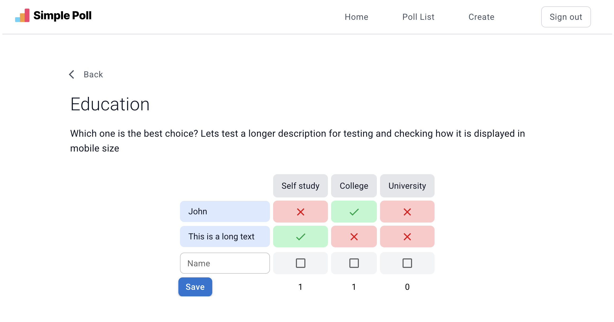

# Simple Poll

A simple React application that allows users to create surveys, share them with others via a link, and collect votes in real-time. Perfect for gathering quick opinions or feedback.

## Demo / Screenshot



Or check out the live demo: [Live Demo](https://update-this-link)

## Features

- Create a new survey with multiple options
- Share the survey link with friends or colleagues
- Participate in surveys by casting your vote
- View poll results in real-time
- Simple, responsive, and user-friendly interface

## Tech Stack

- React
- Typescript
- Vite
- Eslint
- Tailwind
- Material UI
- backend API + local storage for storing surveys

## Installation

```bash

# Clone the repository
git clone https://github.com/anes-webdev/online-poll.git

# Navigate into the project folder
cd poll-app

# Install dependencies
yarn

# Start the development server
yarn dev
```
