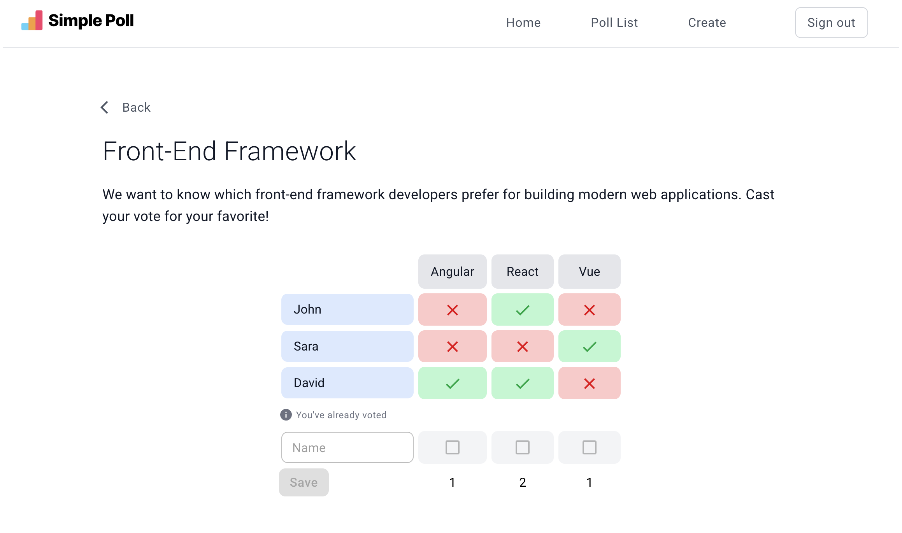

# Online Poll

A simple React application that allows users to create surveys, share them with others via a link, and collect votes in real-time. Perfect for gathering quick opinions or feedback.

## Demo / Screenshot



Or check out the live demo: [Live Demo](https://online-poll-web-production.up.railway.app/)

## Features

- Create a new survey with multiple options
- Share the survey link with friends or colleagues
- Participate in surveys by casting your vote
- View poll results in real-time
- Simple, responsive, and user-friendly interface

## Tech Stack

- React
- Typescript
- Vite
- Eslint
- Tailwind
- Material UI
- backend API + local storage for storing surveys

## 📋 Prerequisites

Make sure you have:

- Node 22.x or higher
- Yarn 4

Verify installation:

```bash
node -v
yarn -v
```

## Installation

```bash

# Clone the repository
git clone https://github.com/anes-webdev/online-poll-web.git

# Navigate into the project folder
cd online-poll-web

# # Add a .env file in the root folder (copy and edit .env.example as needed)
# Example: cp .env.example .env

# Install dependencies
yarn

# Start the development server
yarn dev
```
